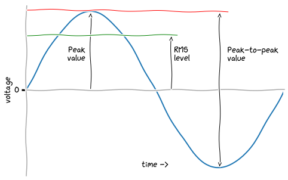

# Mains voltage

* UK mains voltage is 230V *RMS value*
* *RMS* means *root mean square*
* the *RMS value* is calculated from a *peak value*
* the *peak value* is the same as the *amplitude* of the wave
* the *peak value* **isn't the same** as the *peak-to-peak value*
* the *RMS value* depends on the *shape of the wave*
* for a *sinusoid*, the *RMS value* is about `0.707` of its *peak value*
* the coefficient comes from `1/√2 ≈ 0.707`

Thus:

* taking the *RMS value* of `230V`
* `230V / 0.707 ≈ 325V`; that's the *peak value* (or the *amplitude*)
* the *peak-to-peak value* is twice that, at `650V`